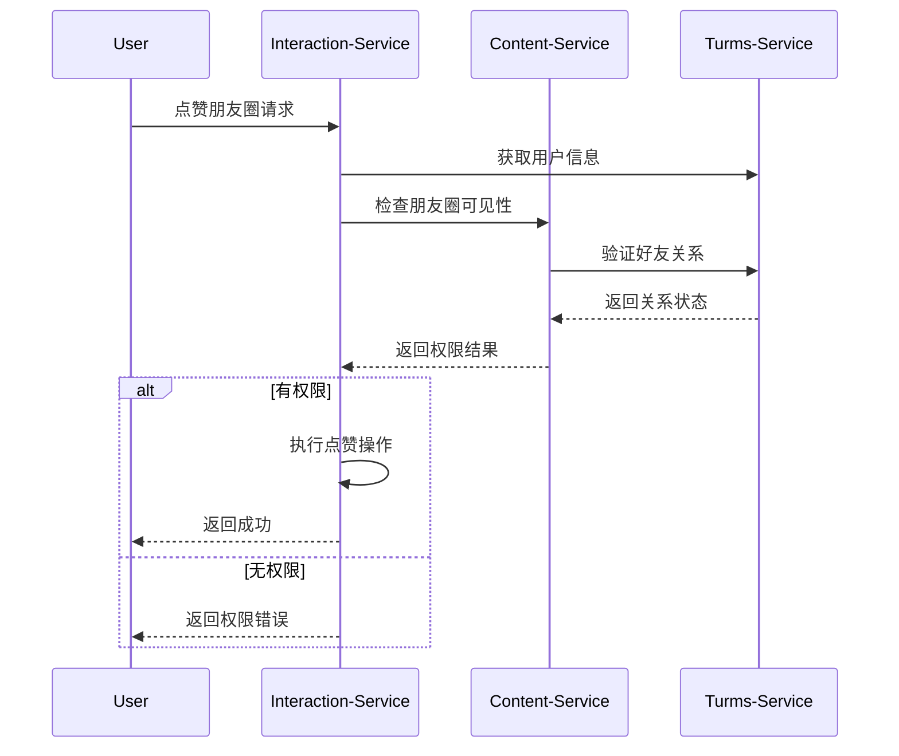
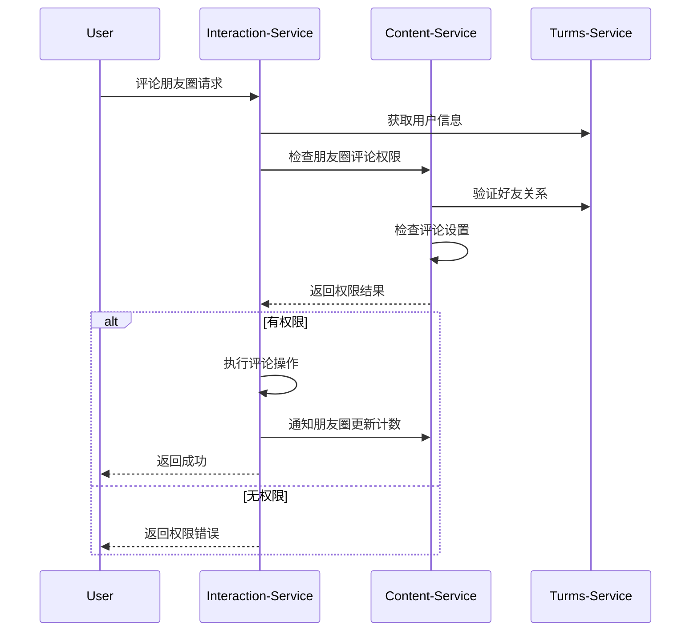

# 朋友圈用户关联集成方案

## 现状总结

### ✅ 已实现的用户关联

1. **点赞功能**
   - 存储点赞用户ID (MySQL + Redis)
   - 用户设备和位置信息
   - 批量用户状态查询

2. **评论功能**  
   - 存储评论用户ID、用户名、头像
   - 用户评论历史查询
   - 评论权限基础框架

3. **用户服务集成**
   - UserServiceClient完整实现
   - 用户信息缓存机制
   - 好友关系检查接口

### ❌ 缺失的用户关联

1. **朋友圈功能** - 尚未实现
2. **权限验证** - 需要增强
3. **用户行为分析** - 需要补充

## 朋友圈用户关联集成方案

### 1. 朋友圈数据模型 (建议在turms-content-service中实现)

```sql
-- 朋友圈动态表
CREATE TABLE moments (
    id BIGINT PRIMARY KEY AUTO_INCREMENT,
    user_id BIGINT NOT NULL COMMENT '发布者ID',
    content TEXT COMMENT '文本内容',
    media_urls JSON COMMENT '媒体文件URLs',
    location_info JSON COMMENT '位置信息',
    
    -- 用户关联字段
    visibility ENUM('PUBLIC', 'FRIENDS', 'PRIVATE', 'CUSTOM') DEFAULT 'FRIENDS',
    visible_to_users JSON COMMENT '自定义可见用户列表',
    invisible_to_users JSON COMMENT '不可见用户列表',
    
    -- 统计字段 (与interaction-service联动)
    like_count INT UNSIGNED DEFAULT 0,
    comment_count INT UNSIGNED DEFAULT 0,
    share_count INT UNSIGNED DEFAULT 0,
    
    status ENUM('DRAFT', 'PUBLISHED', 'HIDDEN', 'DELETED') DEFAULT 'PUBLISHED',
    created_at TIMESTAMP DEFAULT CURRENT_TIMESTAMP,
    updated_at TIMESTAMP DEFAULT CURRENT_TIMESTAMP ON UPDATE CURRENT_TIMESTAMP,
    
    INDEX idx_user_created (user_id, created_at DESC),
    INDEX idx_visibility_created (visibility, created_at DESC)
);

-- 朋友圈用户关系表
CREATE TABLE moment_user_relations (
    moment_id BIGINT NOT NULL,
    user_id BIGINT NOT NULL,
    relation_type ENUM('AUTHOR', 'VISIBLE', 'INVISIBLE', 'BLOCKED') NOT NULL,
    created_at TIMESTAMP DEFAULT CURRENT_TIMESTAMP,
    
    PRIMARY KEY (moment_id, user_id, relation_type),
    INDEX idx_user_relation (user_id, relation_type)
);
```

### 2. 用户权限验证增强

#### 点赞权限验证流程


#### 评论权限验证流程


### 3. 服务间集成接口

#### Content-Service 提供的接口
```java
// 朋友圈权限检查接口
@RestController
@RequestMapping("/api/internal/moments")
public class MomentInternalController {
    
    /**
     * 检查用户是否可以点赞指定朋友圈
     */
    @GetMapping("/{momentId}/permissions/like")
    public Mono<PermissionResult> checkLikePermission(
            @PathVariable String momentId,
            @RequestParam Long userId) {
        // 实现逻辑...
    }
    
    /**
     * 检查用户是否可以评论指定朋友圈
     */
    @GetMapping("/{momentId}/permissions/comment")
    public Mono<PermissionResult> checkCommentPermission(
            @PathVariable String momentId,
            @RequestParam Long userId) {
        // 实现逻辑...
    }
    
    /**
     * 更新朋友圈互动统计
     */
    @POST("/{momentId}/stats")
    public Mono<Void> updateMomentStats(
            @PathVariable String momentId,
            @RequestBody StatsUpdateRequest request) {
        // 实现逻辑...
    }
}
```

#### Interaction-Service 增强的接口
```java
// 增强的点赞控制器
@RestController
@RequestMapping("/api/v3/likes")
public class LikeControllerV3 {
    
    /**
     * 朋友圈点赞 (带权限验证)
     */
    @PostMapping("/moment")
    public Mono<EnhancedLikeResponse> likeMoment(@RequestBody MomentLikeRequest request) {
        // 1. 验证用户身份
        // 2. 检查朋友圈可见性
        // 3. 执行点赞操作
        // 4. 通知朋友圈服务更新统计
    }
}

// 增强的评论控制器  
@RestController
@RequestMapping("/api/v3/comments")
public class CommentControllerV3 {
    
    /**
     * 朋友圈评论 (带权限验证)
     */
    @PostMapping("/moment")
    public Mono<EnhancedCommentResponse> commentMoment(@RequestBody MomentCommentRequest request) {
        // 1. 验证用户身份
        // 2. 检查朋友圈评论权限
        // 3. 执行评论操作
        // 4. 通知朋友圈服务更新统计
    }
}
```

### 4. 用户关系数据同步

#### Redis缓存增强
```
# 用户好友关系缓存
user:friends:1001 → {1002, 1003, 1004, ...}        # 30分钟TTL

# 朋友圈可见性缓存  
moment:visibility:moment_123 → {                    # 10分钟TTL
  "authorId": 1001,
  "visibility": "FRIENDS", 
  "visibleUsers": [1002, 1003],
  "invisibleUsers": [1004]
}

# 用户权限缓存
user:permissions:1001:moment_123 → {                # 5分钟TTL
  "canLike": true,
  "canComment": true,
  "canShare": false
}
```

#### 数据一致性保证
```java
@Service
public class UserRelationSyncService {
    
    /**
     * 定时同步用户关系数据
     */
    @Scheduled(fixedRate = 300000) // 5分钟
    public void syncUserRelations() {
        // 1. 从turms-service获取最新好友关系
        // 2. 更新Redis缓存
        // 3. 清理过期的权限缓存
    }
    
    /**
     * 实时更新用户关系变化
     */
    @EventListener
    public void handleFriendshipChanged(FriendshipChangedEvent event) {
        // 1. 清理相关用户的好友关系缓存
        // 2. 清理相关朋友圈的权限缓存
        // 3. 重新计算可见性
    }
}
```

### 5. 用户行为分析

#### 互动统计表
```sql
-- 用户互动统计表
CREATE TABLE user_interaction_stats (
    user_id BIGINT PRIMARY KEY,
    total_likes_given INT UNSIGNED DEFAULT 0,
    total_likes_received INT UNSIGNED DEFAULT 0,
    total_comments_given INT UNSIGNED DEFAULT 0,
    total_comments_received INT UNSIGNED DEFAULT 0,
    total_moments_published INT UNSIGNED DEFAULT 0,
    last_active_at TIMESTAMP DEFAULT CURRENT_TIMESTAMP,
    updated_at TIMESTAMP DEFAULT CURRENT_TIMESTAMP ON UPDATE CURRENT_TIMESTAMP,
    
    INDEX idx_last_active (last_active_at DESC)
);

-- 用户关系互动统计
CREATE TABLE user_mutual_interactions (
    user_id1 BIGINT,
    user_id2 BIGINT,
    mutual_likes INT UNSIGNED DEFAULT 0,
    mutual_comments INT UNSIGNED DEFAULT 0,
    last_interaction_at TIMESTAMP DEFAULT CURRENT_TIMESTAMP,
    
    PRIMARY KEY (user_id1, user_id2),
    INDEX idx_last_interaction (last_interaction_at DESC)
);
```

#### 行为分析API
```java
@RestController
@RequestMapping("/api/v1/analytics")
public class UserAnalyticsController {
    
    /**
     * 获取用户互动统计
     */
    @GetMapping("/users/{userId}/interactions")
    public Mono<UserInteractionStats> getUserInteractionStats(@PathVariable Long userId) {
        // 返回用户的互动统计数据
    }
    
    /**
     * 获取用户好友互动排行
     */
    @GetMapping("/users/{userId}/friends/interactions")
    public Flux<FriendInteractionRank> getFriendInteractionRanks(@PathVariable Long userId) {
        // 返回与好友的互动排行
    }
}
```

## 实施优先级

### 第一阶段 (立即实施)
1. ✅ **权限验证增强** - LikeServiceV3, CommentServiceV3
2. ✅ **用户信息自动获取** - 避免前端重复传递
3. ✅ **好友关系检查** - 集成现有UserServiceClient

### 第二阶段 (1-2周内)
1. 🔄 **朋友圈服务集成** - 等待turms-content-service实现
2. 🔄 **权限缓存优化** - Redis缓存用户关系和权限
3. 🔄 **数据同步机制** - 定时任务和事件监听

### 第三阶段 (2-4周内)  
1. ⏳ **用户行为分析** - 统计表和分析API
2. ⏳ **高级功能** - @mentions, 互动推荐等
3. ⏳ **性能优化** - 批量操作和缓存策略

## 总结

**当前用户关联状态**:
- ✅ 点赞功能：基础用户关联已实现，需要权限验证增强
- ✅ 评论功能：基础用户关联已实现，需要权限验证增强  
- ❌ 朋友圈功能：尚未实现，需要在turms-content-service中开发

**下一步行动**:
1. 使用提供的LikeServiceV3和CommentServiceV3增强现有功能
2. 等待turms-content-service实现朋友圈核心功能
3. 集成服务间权限验证机制
4. 完善用户行为分析功能

整体来说，基础的用户关联已经实现，主要缺失的是**权限验证**和**朋友圈功能**的深度集成。