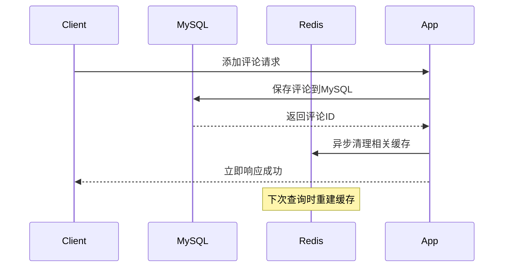
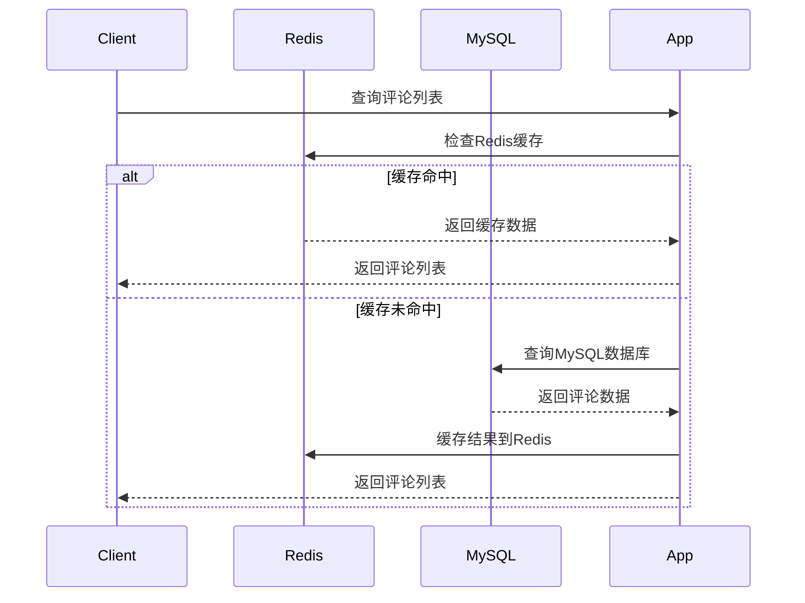

# MySQL主导 + Redis缓存评论系统

## 系统设计理念

基于**MySQL主导 + Redis缓存**的一级评论系统，专注于简单高效的评论功能实现。

### 核心优势

1. **简单可靠**: 一级评论结构，避免复杂的层级查询
2. **性能优化**: MySQL简单索引 + Redis缓存，满足高并发需求
3. **易于维护**: 标准SQL查询，成熟的技术栈
4. **扩展友好**: 简单结构便于功能扩展和优化

## 技术架构

### 数据存储策略

#### MySQL 存储结构
```sql
-- 评论主表 (简单一级结构)
comments: id, article_id, user_id, username, content, like_count, created_at, status

-- 评论计数表 (汇总统计)
comment_counts: article_id, comment_count, approved_count, last_comment_at

-- 同步日志表 (缓存追踪)
comment_cache_log: sync_type, article_id, sync_status, retry_count
```

#### Redis 缓存结构
```
# 评论列表缓存 (List)
comment:list:article_001:latest:0:20 → [评论对象列表]
comment:list:article_001:hot:0:10 → [热门评论列表]

# 评论计数缓存 (String)
comment:count:article_001 → 15

# 热门评论缓存 (List)
comment:hot:article_001 → [高赞评论列表]
```

### 操作流程

#### 添加评论流程


#### 查询评论流程


## 核心功能实现

### 1. 评论添加

**特性**:
- MySQL事务保证数据一致性
- 异步缓存清理不影响响应时间
- 自动触发器更新计数表

**API**: `POST /api/v2/comments`
```json
{
  "articleId": "article_001",
  "userId": 1001,
  "username": "用户名",
  "content": "评论内容",
  "deviceType": "mobile"
}
```

### 2. 评论列表查询

**特性**:
- Redis缓存优先，2小时TTL
- 支持按时间/热度排序
- 分页查询优化

**API**: `GET /api/v2/comments/article/{articleId}?page=0&size=20&sortBy=latest`

### 3. 评论计数查询

**特性**:
- Redis缓存优化
- MySQL触发器自动维护
- 实时性与性能平衡

**API**: `GET /api/v2/comments/count/{articleId}`

### 4. 热门评论

**特性**:
- 基于点赞数排序
- 30分钟缓存TTL
- 小数据集快速响应

**API**: `GET /api/v2/comments/hot/{articleId}?limit=10`

### 5. 评论更新/删除

**特性**:
- 权限验证（仅本人可操作）
- 软删除保留数据
- 自动缓存清理

**API**: `PUT /api/v2/comments/{commentId}` | `DELETE /api/v2/comments/{commentId}`

## 索引设计

### 高效索引策略

```sql
-- 核心索引：满足90%查询场景
INDEX idx_article_created (article_id, created_at DESC)  -- 文章评论时间排序
INDEX idx_article_likes (article_id, like_count DESC)    -- 文章评论热度排序
INDEX idx_user_created (user_id, created_at DESC)        -- 用户评论历史
INDEX idx_status_created (status, created_at DESC)       -- 状态筛选
INDEX idx_created_at (created_at)                        -- 时间范围查询
```

### 查询性能优化

1. **文章评论查询**: `(article_id, created_at)` 复合索引
2. **热门评论查询**: `(article_id, like_count)` 复合索引  
3. **用户历史查询**: `(user_id, created_at)` 复合索引
4. **管理后台查询**: `(status, created_at)` 复合索引

## 缓存策略

### 缓存设计原则

1. **写时清理**: 添加/更新/删除评论时清理相关缓存
2. **读时构建**: 查询时若缓存未命中则重新构建
3. **分层TTL**: 不同类型数据使用不同过期时间
4. **键值设计**: 包含查询参数，支持精确缓存

### 缓存键命名规范

```
comment:list:{articleId}:{sortBy}:{page}:{size}  # 评论列表
comment:count:{articleId}                        # 评论计数
comment:hot:{articleId}                          # 热门评论
```

### 缓存过期策略

- **评论列表**: 2小时（平衡实时性与性能）
- **评论计数**: 2小时（与列表同步）
- **热门评论**: 30分钟（热度变化较快）

## 数据一致性保证

### 强一致性场景

1. **评论写入**: MySQL事务保证
2. **计数更新**: 数据库触发器自动维护
3. **权限控制**: 应用层验证 + 数据库约束

### 最终一致性场景

1. **缓存更新**: 异步清理，下次查询重建
2. **热门评论**: 允许短暂延迟，不影响业务
3. **统计数据**: 定时同步校正

### 异常处理策略

1. **MySQL不可用**: 返回错误，不降级到缓存
2. **Redis不可用**: 直接查询MySQL，不影响功能
3. **缓存不一致**: 提供手动刷新接口

## 性能指标

### 目标性能

- 评论列表查询: P95 < 50ms（缓存命中）
- 评论添加: P95 < 200ms（包含MySQL写入）
- 评论计数查询: P95 < 10ms（Redis缓存）
- 并发处理: 支持5000QPS评论查询

### 监控指标

```yaml
# 业务指标
- 评论添加成功率 (目标: >99.9%)
- 评论查询响应时间 (目标: P95<50ms)
- 缓存命中率 (目标: >80%)

# 技术指标  
- MySQL连接池使用率
- Redis内存使用率
- 评论表大小增长率
```

## 扩展性设计

### 水平扩展

1. **MySQL分片**: 按article_id哈希分片
2. **Redis集群**: 支持水平扩展
3. **应用集群**: 无状态服务，易于扩展

### 功能扩展

1. **回复功能**: 增加parent_id字段支持二级回复
2. **表情回应**: 扩展like_count为reactions表
3. **敏感词过滤**: 集成内容审核服务
4. **实时推送**: 集成WebSocket或SSE

## 部署配置

### MySQL配置优化

```sql
# 评论表优化配置
innodb_buffer_pool_size = 1G          # 缓冲池大小
innodb_flush_log_at_trx_commit = 2    # 提升写入性能
innodb_log_file_size = 256M           # 日志文件大小
```

### Redis配置优化

```redis
# 评论缓存优化配置
maxmemory-policy allkeys-lru           # LRU淘汰策略
save 900 1                             # 持久化策略
tcp-keepalive 300                      # 连接保活
```

### 应用配置

```yaml
spring:
  datasource:
    hikari:
      maximum-pool-size: 20            # 连接池大小
      minimum-idle: 5                  # 最小空闲连接
  data:
    redis:
      lettuce:
        pool:
          max-active: 200              # Redis连接池
```

## 测试验证

### 功能测试

```bash
# 添加评论
curl -X POST http://localhost:8530/api/v2/comments \
  -H "Content-Type: application/json" \
  -d '{"articleId":"article_001","userId":1001,"username":"test","content":"测试评论"}'

# 查询评论列表  
curl "http://localhost:8530/api/v2/comments/article/article_001?page=0&size=10"

# 查询评论计数
curl "http://localhost:8530/api/v2/comments/count/article_001"

# 查询热门评论
curl "http://localhost:8530/api/v2/comments/hot/article_001?limit=5"
```

### 性能测试

```bash
# 使用JMeter或ab进行压力测试
ab -n 10000 -c 100 http://localhost:8530/api/v2/comments/article/article_001
```

## 监控运维

### 关键监控项

1. **MySQL监控**
   - 慢查询日志
   - 连接数使用情况
   - 表空间大小

2. **Redis监控**
   - 内存使用率
   - 命中率统计
   - 键过期情况

3. **应用监控**
   - API响应时间
   - 错误率统计
   - 业务指标

### 告警策略

```yaml
# 告警规则
- 评论API响应时间 > 500ms (持续5分钟)
- 缓存命中率 < 60% (持续10分钟)  
- MySQL连接池使用率 > 80%
- Redis内存使用率 > 85%
```

## 总结

这个MySQL主导 + Redis缓存的评论系统具有以下特点：

✅ **简单可靠**: 一级评论结构，避免复杂查询  
✅ **性能优化**: 合理的索引设计 + Redis缓存加速  
✅ **易于维护**: 标准SQL + 成熟技术栈  
✅ **扩展友好**: 简单架构便于功能扩展  
✅ **高可用**: 多层容错机制  

该系统适用于绝大部分评论场景，为用户提供快速稳定的评论体验。