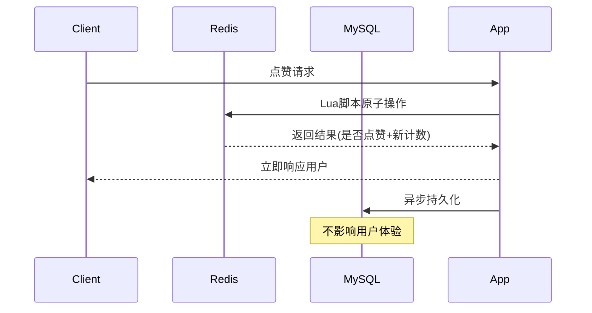

# Redis主导 + MySQL持久化点赞系统

## 系统设计理念

基于**Redis主导 + MySQL持久化**的高性能点赞系统，实现毫秒级响应和数据可靠性的完美平衡。

### 核心优势

1. **毫秒级响应**: Redis内存操作，ZSET天然排序，SET天然去重
2. **原子性保证**: Lua脚本确保操作原子性，避免数据竞态
3. **数据持久化**: MySQL异步持久化，支持数据恢复和审计
4. **高并发支持**: Redis集群 + 连接池优化，支持百万级并发

## 技术架构

### 数据存储策略

#### Redis 存储结构
```
# 点赞计数 (String)
like:count:POST:123 → 1500

# 用户点赞集合 (Set)
like:user:1001 → {POST:123, COMMENT:456, ...}

# 目标点赞集合 (Set) 
like:target:POST:123 → {1001, 1002, 1003, ...}
```

#### MySQL 存储结构
```sql
-- 点赞记录表 (详细记录)
likes: id, user_id, target_type, target_id, device_info, created_at

-- 点赞计数表 (汇总统计)  
like_counts: target_type, target_id, like_count, last_sync_at

-- 同步日志表 (同步追踪)
like_sync_log: sync_type, status, error_message, retry_count
```

### 操作流程

#### 点赞/取消点赞流程


#### Lua脚本保证原子性
```lua
-- 原子切换点赞状态
local isLiked = redis.call('SISMEMBER', userSetKey, target)
if isLiked == 1 then
    -- 取消点赞：删除关系 + 减少计数
    redis.call('SREM', userSetKey, target)
    redis.call('SREM', targetSetKey, userId) 
    local newCount = redis.call('DECR', countKey)
    return {0, newCount}
else
    -- 添加点赞：添加关系 + 增加计数
    redis.call('SADD', userSetKey, target)
    redis.call('SADD', targetSetKey, userId)
    local newCount = redis.call('INCR', countKey)
    return {1, newCount}
end
```

## 核心功能实现

### 1. 点赞状态切换

**特性**:
- Redis Lua脚本保证原子性
- 异步MySQL持久化
- 自动设置过期时间(7天)

**API**: `POST /api/v2/likes/toggle`
```json
{
  "userId": 1001,
  "targetType": "POST", 
  "targetId": "123",
  "deviceType": "mobile",
  "ipAddress": "192.168.1.100"
}
```

### 2. 点赞计数查询

**特性**:
- Redis优先查询
- MySQL数据恢复
- 自动缓存同步

**API**: `GET /api/v2/likes/count?targetType=POST&targetId=123`

### 3. 用户点赞状态检查

**特性**:
- Redis SET成员检查
- MySQL数据回退
- 批量查询优化

**API**: `GET /api/v2/likes/status?userId=1001&targetType=POST&targetId=123`

### 4. 批量状态查询

**特性**:
- 单次请求查询多个目标
- 并行处理提高性能
- 适用于列表页面

**API**: `POST /api/v2/likes/batch/status`

### 5. 点赞用户列表

**特性**:
- Redis SET分页查询
- 毫秒级响应
- 支持大量用户列表

**API**: `GET /api/v2/likes/users?targetType=POST&targetId=123&page=0&size=20`

### 6. 数据恢复机制

**特性**:
- MySQL → Redis数据恢复
- 适用于Redis重启后
- 管理员手动触发

**API**: `POST /api/v2/likes/recover?targetType=POST&targetId=123`

## 性能优化

### Redis 优化策略

1. **连接池配置**
   ```yaml
   spring:
     data:
       redis:
         lettuce:
           pool:
             max-active: 200    # 最大连接数
             max-idle: 20       # 最大空闲连接
             min-idle: 5        # 最小空闲连接
   ```

2. **过期时间设置**
   - 点赞计数: 7天
   - 用户点赞集合: 7天  
   - 目标点赞集合: 7天

3. **内存优化**
   - 使用紧凑的键名
   - 定期清理过期数据
   - 监控内存使用率

### MySQL 优化策略

1. **索引设计**
   ```sql
   -- 复合唯一索引：防重复点赞
   UNIQUE KEY uk_user_target (user_id, target_type, target_id)
   
   -- 查询优化索引
   INDEX idx_target_created (target_type, target_id, created_at)
   INDEX idx_user_created (user_id, created_at)
   ```

2. **分区策略**
   ```sql
   -- 按时间分区（可选）
   PARTITION BY RANGE (YEAR(created_at)) (
       PARTITION p2024 VALUES LESS THAN (2025),
       PARTITION p2025 VALUES LESS THAN (2026)
   );
   ```

3. **异步写入**
   ```java
   // 非阻塞MySQL写入
   .subscribeOn(Schedulers.boundedElastic())
   ```

## 数据一致性保证

### 最终一致性模型

1. **强一致性场景**: 实时点赞状态查询（Redis）
2. **最终一致性场景**: 历史数据统计（MySQL）
3. **数据恢复**: Redis故障时从MySQL恢复

### 异常处理策略

1. **Redis不可用**
   - 降级到MySQL直接操作
   - 自动重试机制
   - 告警通知运维

2. **MySQL写入失败**
   - 记录失败日志
   - 定时重试机制
   - 不影响Redis操作

3. **数据不一致**
   - 定时同步任务
   - 数据校验机制
   - 手动数据恢复

## 监控指标

### 性能指标
- Redis操作延迟 (P95 < 5ms)
- MySQL写入延迟 (P95 < 100ms) 
- API响应时间 (P95 < 50ms)
- 点赞操作QPS (目标: 10万/秒)

### 业务指标  
- 每日点赞总数
- 用户活跃度
- 热门内容排行
- 点赞取消比率

### 系统指标
- Redis内存使用率
- MySQL连接池状态
- 异步队列积压
- 错误率统计

## 扩展性设计

### 水平扩展
1. **Redis集群**: 支持分片和高可用
2. **MySQL读写分离**: 主从复制 + 读写分离
3. **API网关**: 负载均衡和限流
4. **消息队列**: 解耦异步处理

### 功能扩展
1. **点赞排行榜**: Redis ZSET实现
2. **点赞通知**: Kafka消息推送  
3. **反作弊**: 频率限制 + IP风控
4. **数据分析**: 点赞行为挖掘

## 部署配置

### Docker 部署
```bash
# 启动MySQL
docker-compose -f docker-compose.mysql.yml up -d

# 检查MySQL状态
docker exec turms-mysql mysql -u turms -pturms123456 -e "SELECT COUNT(*) FROM turms_interaction.likes"
```

### 应用配置
```yaml
spring:
  datasource:
    url: jdbc:mysql://localhost:3306/turms_interaction
    username: turms
    password: turms123456
  data:
    redis:
      host: localhost
      port: 6379
```

## 测试验证

### 功能测试
```bash
# 点赞操作
curl -X POST http://localhost:8530/api/v2/likes/toggle \
  -H "Content-Type: application/json" \
  -d '{"userId":1001,"targetType":"POST","targetId":"123"}'

# 查询计数  
curl "http://localhost:8530/api/v2/likes/count?targetType=POST&targetId=123"

# 检查状态
curl "http://localhost:8530/api/v2/likes/status?userId=1001&targetType=POST&targetId=123"
```

### 性能测试
```bash
# 使用JMeter或ab进行压力测试
ab -n 10000 -c 100 http://localhost:8530/api/v2/likes/toggle
```

## 总结

这个Redis主导 + MySQL持久化的点赞系统具有以下特点：

✅ **高性能**: 毫秒级响应，支持百万级并发  
✅ **高可靠**: 数据持久化，支持灾难恢复  
✅ **高可用**: 集群部署，自动故障转移  
✅ **易扩展**: 微服务架构，水平扩展能力  
✅ **易运维**: 完善监控，自动化部署  

该系统适用于各种社交场景、内容平台和互动应用，为用户提供流畅的点赞体验。